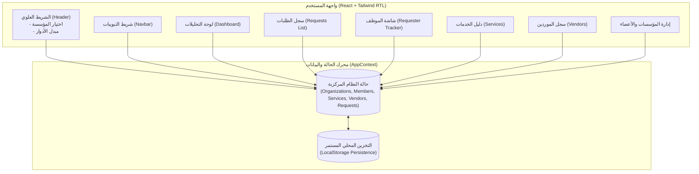

# 01 - System Overview (نظرة عامة على النظام)

> **تصنيف الأدلة البرمجية (System Intelligence Evidence Classification):**
> - **الحالة الإجمالية:** [VERIFIED] تم الفحص والتحقق مباشرة من الكود المصدري وإعدادات الحزم في `package.json` و `src/`.

---

## 1. الغرض والمشكلة التي يعالجها النظام (Core Problem & Purpose)
**نظام مصروفي** هو منصة مركزية لإدارة ومتابعة المصروفات والعهد متعددة المؤسسات والكيانات المالية.
يحل النظام المشاكل التشغيلية الشائعة في الشركات التي تدير عدة مؤسسات أو فروع:
1. **تشتت البيانات بين الفروع والمؤسسات:** يوفر عزل بيانات كل مؤسسة (Multi-Tenant Scoping) مع إمكانية استعراض لوحة مجمعة (Unified View) للإدارة العليا.
2. **غياب الشفافية للموظف طالب الصرف:** يوفر شاشة تتبع حية (Requester Tracker) بنظام شريط التقدم المرئي (4-Step Stepper) وملاحظات الاستيضاح المباشرة وتفاصيل سند الصرف.
3. **فقدان ضبط الميزانيات وتصنيف الخدمات:** يقيد كل مصروف ببند خدمة محدد ومقدم خدمة معتمد، مع مؤشرات استهلاك حية للميزانية.
4. **فقدان المتابعة البنكية والمحاسبية:** تسجيل بيانات الصرف الفعلي (الحوالة، رقم المرجع، البنك، والتاريخ) وتحديث إجمالي المدفوعات للمورد وميزانية الخدمة فورياً.

---

## 2. المكدس التقني الفعلي (Verified Tech Stack)

| الطبقة / المكون | التقنية المعتمدة | ملف التحقق (Evidence) | ملاحظات معمارية |
| :--- | :--- | :--- | :--- |
| **محرك التطوير والبناء** | Vite 8.3.0 | `package.json`, `vite.config.ts` | تجميع وبناء فائق السرعة عبر ES Modules. |
| **واجهة المستخدم** | React 19.2.8 | `package.json`, `src/main.tsx` | استخدام React 19 ومكونات وظيفية حديثة مع Hooks. |
| **لغة البرمجة** | TypeScript 6.0 | `tsconfig.app.json`, `src/types/index.ts` | نمذجة دقيقة للأنواع والكيانات وحالات الطلبات. |
| **تنسيق الواجهات** | Tailwind CSS v4 | `vite.config.ts`, `src/index.css` | استيراد `@import "tailwindcss";` مع دعم أصيل لنظام RTL. |
| **الرسوم البيانية المالية** | Recharts 3.10.1 | `package.json`, `DashboardAnalytics.tsx` | رسوم بيانية تفاعلية (BarChart, PieChart, Tooltips). |
| **الأيقونات** | Lucide React 1.46 | `package.json` | أيقونات واضحة معبرة عن العمليات المالية. |
| **إدارة الحالة والتخزين** | React Context + LocalStorage | `src/context/AppContext.tsx` | حفظ واسترجاع ومزامنة فورية لكافة العمليات والكيانات. |

---

## 3. الهيكلية المعمارية العامة (Architecture Map)

---

## 4. مستويات الوصول والأدوار (User Roles Matrix)

| الدور (Role) | الصلاحيات البرمجية المفعلة | شاشة الاستخدام المفضلة |
| :--- | :--- | :--- |
| **مدير المؤسسة (`org_admin`)** | اعتماد الطلبات، طلب توضيح، رفض الطلبات، تسجيل وتنفيذ الصرف المالي، إضافة وتعديل الخدمات والموردين والمؤسسات والأعضاء. | لوحة التحليلات، سجل الطلبات، الخدمات، الموردين. |
| **طالب الصرف / الموظف (`employee`)** | تقديم طلبات صرف جديدة، رفع المرفقات، متابعة مسار الطلبات في شاشة تتبع خاصة، والرد على استفسارات المدير وتزويده بالمستندات. | تتبع طلباتي (Requester Tracker). |
| **عرض موحد (Multi-Org View)** | تجميع كافة التدفقات المالية لكافة المؤسسات دون تفرقة لعرض أداء المحفظة الاستثمارية بالكامل. | لوحة التحكم والتحليلات. |
