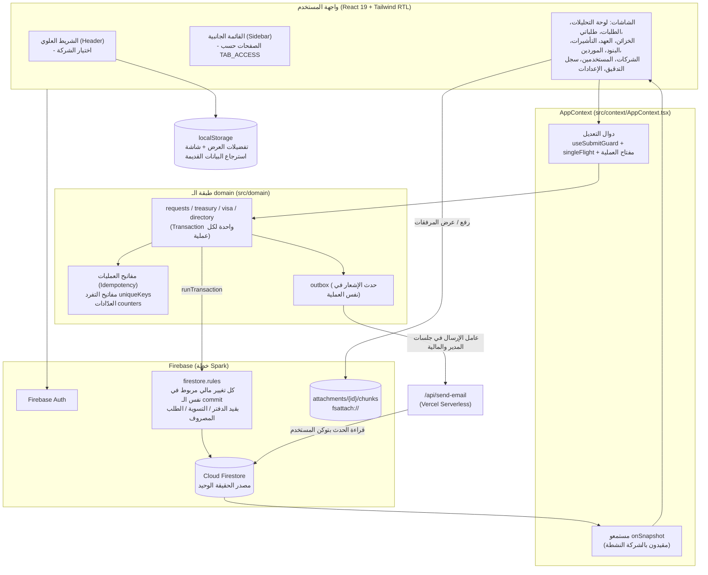

# 01 - System Overview (نظرة عامة على النظام)

> **تصنيف الأدلة البرمجية (System Intelligence Evidence Classification):**
> - **الحالة الإجمالية:** [VERIFIED] تم الفحص والتحقق مباشرة من الكود المصدري: `package.json`، `src/`، `firestore.rules`، `api/`، `vercel.json` و`.github/workflows/ci.yml`.
> - تفاصيل سلامة البيانات ومنع التكرار في [05-data-integrity-and-idempotency.md](05-data-integrity-and-idempotency.md)، وقواعد الأمان والنشر في [06-security-rules-deploy.md](06-security-rules-deploy.md).

---

## 1. الغرض والمشكلة التي يعالجها النظام (Core Problem & Purpose)
**نظام مصروفي** هو منصة مركزية لإدارة ومتابعة المصروفات والخزائن والعهد متعددة الشركات والكيانات المالية.
يحل النظام المشاكل التشغيلية الشائعة في الشركات التي تدير عدة مؤسسات أو فروع:
1. **تشتت البيانات بين الفروع والمؤسسات:** عزل بيانات كل شركة (Multi-Tenant Scoping) تفرضه قواعد الأمان `firestore.rules` على مستوى قاعدة البيانات، مع لوحة مجمعة (Unified View) للمشرف العام.
2. **غياب الشفافية للموظف طالب الصرف:** شاشة تتبع حية (Requester Tracker) بشريط مراحل مرئي (4-Step Stepper) وملاحظات الاستيضاح المباشرة وتفاصيل سند الصرف.
3. **فقدان ضبط الميزانيات وتصنيف الخدمات:** يقيد كل مصروف ببند صرف ومقدم خدمة، مع مؤشرات استهلاك حية للميزانية.
4. **فقدان المتابعة البنكية والمحاسبية:** كل صرف يخصم من خزينة/حساب محدد ويُسجَّل له قيد في دفتر الأستاذ (`accountTransactions`) في نفس العملية الذرية، مع تحديث ميزانية البند وإجمالي المورد.
5. **الخزائن والعهد والتأشيرات:** حسابات بنكية وإنستاباي ومحافظ وكاش، تحويلات بين الحسابات، عهد نقدية وتسوياتها واستردادها، وطلبات تأشيرات بدفعات.

---

## 2. المكدس التقني الفعلي (Verified Tech Stack)

| الطبقة / المكون | التقنية المعتمدة | ملف التحقق (Evidence) | ملاحظات معمارية |
| :--- | :--- | :--- | :--- |
| **محرك التطوير والبناء** | Vite 8 | `package.json`, `vite.config.ts` | تجميع وبناء عبر ES Modules، مع تقسيم الحزم (`vendor-firebase`, `vendor-charts` …). |
| **واجهة المستخدم** | React 19 | `package.json`, `src/main.tsx` | مكونات وظيفية مع Hooks، والشاشات الثقيلة تُحمَّل عند الحاجة (lazy). |
| **لغة البرمجة** | TypeScript 6 | `tsconfig.app.json`, `src/types/index.ts` | نمذجة الأنواع والكيانات وحالات الطلبات. |
| **تنسيق الواجهات** | Tailwind CSS v4 | `vite.config.ts`, `src/index.css` | `@import "tailwindcss";` مع واجهة عربية RTL وخط IBM Plex Sans Arabic من Google Fonts. |
| **الرسوم البيانية المالية** | Recharts 3 | `package.json`, `DashboardAnalytics.tsx` | رسوم بيانية تفاعلية لكل عملة على حدة. |
| **الأيقونات** | Lucide React | `package.json` | |
| **المصادقة** | Firebase Authentication | `src/lib/firebase.ts` | بريد وكلمة مرور، أو Google (نافذة منبثقة `signInWithPopup`). |
| **قاعدة البيانات (مصدر الحقيقة الوحيد)** | Cloud Firestore (خطة Spark المجانية) | `src/lib/firebase.ts`, `src/domain/*` | كل بيانات الأعمال في Firestore. كاش Firestore الرسمي (IndexedDB، آمن بين التبويبات) للتشغيل السريع ودون اتصال. |
| **منطق الأعمال** | طبقة الـ domain | `src/domain/*.ts` | كل عملية مالية Transaction واحدة بمفتاح عملية (Idempotency Key). |
| **الحماية على الخادم** | `firestore.rules` | `firestore.rules`, `tests-rules/` | الحارس الوحيد على جانب الخادم (لا توجد Cloud Functions على خطة Spark). |
| **المرفقات** | Firestore (أجزاء) | `src/lib/attachments.ts`, `src/lib/attachmentsCore.ts` | لا يوجد Cloud Storage على خطة Spark: الملف مقسَّم إلى `attachments/{id}/chunks`، والرابط `fsattach://<id>`. |
| **الإشعارات** | Outbox + `/api/send-email` | `src/domain/outbox.ts`, `api/send-email.ts` | دالة Vercel Serverless ترسل البريد (Resend / Brevo / Gmail SMTP). |
| **الاستضافة** | Vercel (من فرع `main`) | `vercel.json` | ترويسات الأمان، وإعادة توجيه كل المسارات إلى `index.html` عدا `/api/*`. |
| **التكامل المستمر** | GitHub Actions | `.github/workflows/ci.yml` | lint + build + اختبارات الوحدة + اختبارات قواعد الأمان على الـ emulator. |
| **إدارة الحالة في الواجهة** | React Context (`AppContext`) | `src/context/AppContext.tsx` | مستمعو `onSnapshot` يغذّون الحالة، والتعديلات تمر عبر الـ domain. `localStorage` لتفضيلات العرض فقط (انظر القسم 3). |

---

## 3. الهيكلية المعمارية العامة (Architecture Map)

```mermaid
flowchart TD
    subgraph Client["واجهة المستخدم (React 19 + Tailwind RTL)"]
        Header["الشريط العلوي (Header)\n- اختيار الشركة"]
        Sidebar["القائمة الجانبية (Sidebar)\n- الصفحات حسب TAB_ACCESS"]
        Views["الشاشات: لوحة التحليلات، الطلبات، طلباتي،\nالخزائن، العهد، التأشيرات، البنود، الموردين،\nالشركات، المستخدمين، سجل التدقيق، الإعدادات"]
    end

    subgraph Ctx["AppContext (src/context/AppContext.tsx)"]
        Listeners["مستمعو onSnapshot\n(مقيدون بالشركة النشطة)"]
        Mutations["دوال التعديل\nuseSubmitGuard + singleFlight + مفتاح العملية"]
    end

    subgraph Domain["طبقة الـ domain (src/domain)"]
        Ops["requests / treasury / visa / directory\n(Transaction واحدة لكل عملية)"]
        Keys["مفاتيح العمليات (Idempotency)\nمفاتيح التفرد uniqueKeys\nالعدّادات counters"]
        Outbox["outbox (حدث الإشعار في نفس العملية)"]
    end

    subgraph Firebase["Firebase (خطة Spark)"]
        Auth["Firebase Auth"]
        FS[("Cloud Firestore\nمصدر الحقيقة الوحيد")]
        Rules["firestore.rules\nكل تغيير مالي مربوط في نفس الـ commit\nبقيد الدفتر / التسوية / الطلب المصروف"]
        Attach[("attachments/{id}/chunks\nfsattach://")]
    end

    API["/api/send-email\n(Vercel Serverless)"]
    Local[("localStorage\nتفضيلات العرض + شاشة استرجاع البيانات القديمة")]

    Views --> Mutations
    Listeners --> Views
    Mutations --> Ops
    Ops --> Keys
    Ops --> Outbox
    Ops -->|runTransaction| Rules
    Rules --> FS
    FS --> Listeners
    Views -->|رفع / عرض المرفقات| Attach
    Outbox -->|عامل الإرسال في جلسات المدير والمالية| API
    API -->|قراءة الحدث بتوكن المستخدم| FS
    Header --> Local
    Client --> Auth
```

- **Firestore هو المصدر الوحيد لبيانات الأعمال.** لا توجد كتابة مزدوجة إلى أي مخزن آخر.
- **`firestore.rules` هو الحارس الوحيد على الخادم.** فحوص الـ domain تعطي رسائل عربية واضحة مبكراً، لكن القواعد تفرض نفس السياسات على أي عميل (بما فيه من يستخدم Firestore SDK مباشرة). كل تغيير في رصيد حساب أو عهدة أو ميزانية بند أو إجمالي مورد مربوط في نفس الـ commit بما يفسّره: قيد الدفتر (`lastLedgerId`)، أو تسوية العهدة (`lastSettlementId`)، أو الطلب المصروف (`lastDisbursedRequestId`). اختبارات ذلك في `tests-rules/binding.test.ts` و`tests-rules/attacks.test.ts`.
- **`localStorage` ليس قاعدة بيانات**: يحفظ الشركة والصفحة النشطة، وحالة قراءة الإشعارات، وإعداد اتصال Firebase مخصص إن أدخله المستخدم من نافذة الإعدادات. مفاتيح البيانات القديمة (من الإصدار الذي كان يخزن فيه) لا تُقرأ كمصدر بيانات ولا تُحذف تلقائياً، وتقرؤها فقط شاشة «استرجاع بيانات محلية / نسخة احتياطية» (انظر 05، القسم 9).
- **الخادم `server/` (Express + SQLite)** مرجع محلي مستقل لا يستخدمه التطبيق، ويرفض التشغيل عند `NODE_ENV=production` (إلا بالمتغير الصريح `ALLOW_PROD_STANDALONE_SERVER=true`).

---

## 4. مستويات الوصول والأدوار (User Roles Matrix)

المرجع الوحيد لما تعرضه الشاشات هو `src/utils/permissions.ts` (`PERMISSIONS`، `TAB_ACCESS`)، ويطابق فحوص الأدوار في `src/domain/*` وفي `firestore.rules`.

| الدور (Role) | الصلاحيات البرمجية المفعلة | الصفحة الرئيسية |
| :--- | :--- | :--- |
| **المشرف العام (`super_admin`)** | مالك المنصة فقط (`mahmoud@tieapps.com`). كل الشركات، إنشاء الشركات وأرشفتها، مشاركة البنود بين الشركات، إعدادات المنصة والبريد، أدوات الصيانة (ترحيل مفاتيح التفرد، فصل الملفات الشخصية اليتيمة)، والعرض الموحد لكل الشركات. | لوحة التحليلات |
| **مدير الشركة (`org_admin`)** | داخل شركته: اعتماد/رفض/استيضاح/صرف الطلبات، الخزائن (إنشاء وحذف الحسابات وفصل المحافظ القديمة)، العهد، التأشيرات، البنود والموردين والأقسام، المستخدمين، سجل التدقيق، وإعدادات الشركة. | لوحة التحليلات |
| **المالية والخزينة (`finance`)** | داخل شركته: اعتماد ورفض وصرف الطلبات، حركات الخزينة والتحويل، صرف العهد واستعاضتها واستردادها، سداد التأشيرات، وتعديل البنود والموردين. لا يدير المستخدمين ولا يطلب استيضاحاً. | لوحة التحليلات |
| **مدخل بيانات (`data_entry`)** | يضيف موردين وأقسام لشركته فقط، ويرى البنود والموردين، ويقدم طلباته ويتابع عهده وتأشيراته. | الموردين |
| **موظف (`employee`)** | تقديم طلبات الصرف ورفع المرفقات، متابعة طلباته، الرد على الاستيضاحات، تسوية عهدته بالفواتير، وطلبات التأشيرات الخاصة به. | طلباتي (Requester Tracker) |

الدور مرتبط بالشركة: دور الشخص في شركة لا ينتقل إلى شركة أخرى (`members/{uid}_{orgId}`)، والعضوية أو الملف الشخصي المعطل (`active: false`) لا يمنح أي صلاحية.
