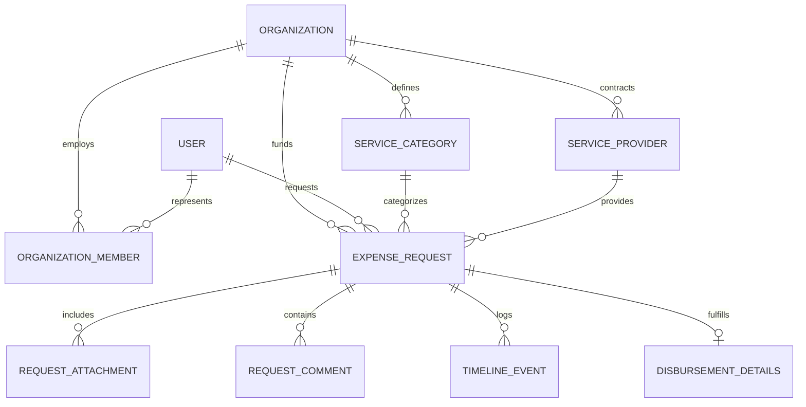

# 02 - Architecture & Data Model (المعمارية ونموذج البيانات)

> **تصنيف الأدلة البرمجية:**
> - [VERIFIED]: مستخرج حرفياً من `src/types/index.ts` و `src/context/AppContext.tsx`.

---

## 1. الكيانات والعلاقات (Entity Relationship Diagram)



---

## 2. تفصيل نموذج البيانات (Data Schema Specification)

### أ. المؤسسة (`Organization`)
```typescript
interface Organization {
  id: string;            // المعرف الفريد للمؤسسة
  name: string;          // اسم المؤسسة التجاري
  code: string;          // الرمز المالي (مثل RWD, AFQ)
  currency: string;      // العملة المعتمدة (SAR, AED, EGP, USD)
  budget: number;        // الميزانية الإجمالية السنوية
  description: string;   // نبذة عن نشاط المؤسسة
  createdAt: string;     // تاريخ الإنشاء
}
```

### ب. عضو المؤسسة (`OrganizationMember`)
```typescript
interface OrganizationMember {
  id: string;            // معرف العضوية
  orgId: string;         // المؤسسة التابع لها (Foreign Key)
  userId: string;        // حساب المستخدم المرتبط
  userName: string;      // الاسم الكامل
  userEmail: string;     // البريد الإلكتروني
  role: 'org_admin' | 'employee'; // الدور والصلاحية
  department: string;    // القسم (التسويق، تقنية المعلومات، العمليات)
  jobTitle: string;      // المسمى الوظيفي
  joinedAt: string;      // تاريخ الانضمام
  active: boolean;       // حالة التفعيل
}
```

### ج. بند الخدمة / مركز التكلفة (`ServiceCategory`)
```typescript
interface ServiceCategory {
  id: string;            // معرف الخدمة
  orgId: string;         // المؤسسة التابعة لها
  name: string;          // اسم الخدمة (مثل: تراخيص سحابية، صيانة)
  code: string;          // كود الخدمة
  description: string;   // الشرح والمواصفات
  budgetLimit: number;   // سقف الميزانية التقديرية للبند
  spentAmount: number;   // إجمالي المصروف الفعلي المحسوب تلقائياً
  color: string;         // لون التمييز في الواجهة والرسوم البيانية
  iconName: string;      // اسم الأيقونة المعبرة
}
```

### د. مقدم الخدمة والمورد (`ServiceProvider`)
```typescript
interface ServiceProvider {
  id: string;            // معرف المورد
  orgId: string;         // المؤسسة التابع لها
  name: string;          // الاسم التجاري للشركة / المورد
  serviceCategoryIds: string[];   // مصفوفة الخدمات المرتبطة
  serviceCategoryNames: string[]; // أسماء الخدمات لسرعة العرض
  contactPerson: string; // اسم مسؤول المبيعات / التواصل
  phone: string;         // رقم الاتصال
  email: string;         // البريد الإلكتروني
  taxNumber: string;     // الرقم الضريبي (15 خانة)
  crNumber: string;      // رقم السجل التجاري (10 خانات)
  bankName: string;      // اسم البنك المعتمد للتحويل
  iban: string;          // رقم الآيبان البنكي
  address: string;       // العنوان والمدينة
  rating: number;        // تقييم الأداء (من 5 نجوم)
  totalPaid: number;     // إجمالي المبالغ المصروفة والمحولة له
  active: boolean;       // حالة التعامل الحالية
  notes?: string;        // ملاحظات التعاقد
}
```

### هـ. طلب المصروف (`ExpenseRequest`)
```typescript
type RequestStatus = 
  | 'pending'                  // قيد مراجعة واعتماد الإدارة
  | 'clarification_requested'  // طلب المدير توضيحاً من الموظف
  | 'approved'                 // معتمد وينتظر التنفيذ المالي
  | 'rejected'                 // تم الرفض مع سبب معلن
  | 'disbursed';               // تم الصرف المالي الفعلي وإغلاق الطلب

interface ExpenseRequest {
  id: string;
  requestNumber: string;       // رقم فريد متسلسل (مثال: REQ-2026-001)
  orgId: string;               // المؤسسة التابع لها الطلب
  requesterId: string;         // معرف طالب الصرف
  requesterName: string;       // اسم طالب الصرف
  requesterDepartment: string; // قسم طالب الصرف
  serviceCategoryId: string;   // بند الخدمة المرتبط
  serviceCategoryName: string; // اسم الخدمة
  providerId: string;          // المورد المرتبط
  providerName: string;        // اسم المورد
  title: string;               // عنوان وموضوع الطلب
  description: string;         // تفاصيل ومواصفات الشراء
  justification: string;       // المبرر المالي للطلب
  amount: number;              // المبلغ المطلوب
  currency: string;            // العملة
  status: RequestStatus;       // الحالة الحالية
  urgency: 'low' | 'medium' | 'high'; // الأهمية والسرعة
  attachments: RequestAttachment[];    // الفواتير وعروض الأسعار
  comments: RequestComment[];          // سجل الملاحظات والاستيضاحات
  timeline: TimelineEvent[];           // سجل مسار وتاريخ الأحداث
  disbursement?: DisbursementDetails;  // بيانات الصرف المالي المكتمل
  rejectionReason?: string;            // سبب الرفض إن وُجد
  createdAt: string;
  updatedAt: string;
}
```

---

## 3. آلية عزل المؤسسات (Multi-Tenancy Scoping Invariant)

في كل عملية قراءة، تصفية، أو إضافة:
1. إذا كانت `activeOrgId === 'all'`: يتم دمج وعرض بيانات جميع المؤسسات (Unified Portfolio View).
2. إذا تم تحديد مؤسسة بعينها: يتم تطبيق الفلتر:
   ```typescript
   const scopedItems = items.filter(item => item.orgId === activeOrgId);
   ```
3. عند إنشاء أي طلب أو خدمة أو مورد جديد: يتم ربطه تلقائياً بـ `activeOrgId` النشطة في السياق.
