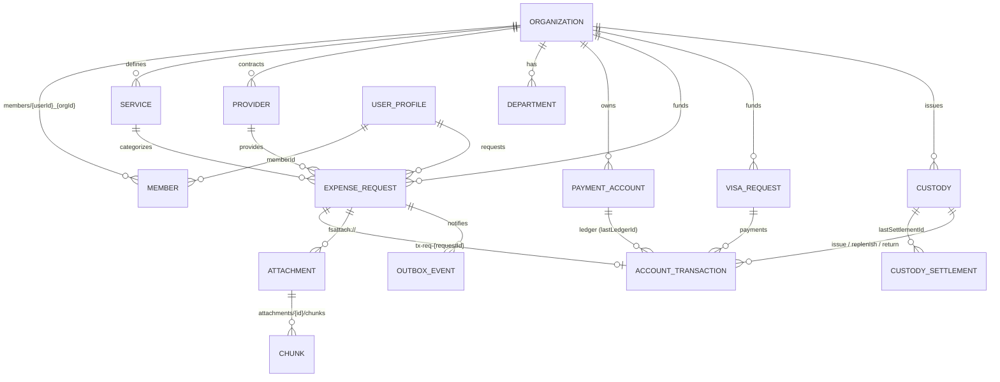

# 02 - Architecture & Data Model (المعمارية ونموذج البيانات)

> **تصنيف الأدلة البرمجية:**
> - [VERIFIED]: مستخرج من `src/types/index.ts` و`src/domain/common.ts` (`COL`) و`src/context/AppContext.tsx` و`firestore.rules`.
> - الواجهات أدناه مختصرة لأهم الحقول؛ المرجع الكامل هو `src/types/index.ts`.

---

## 1. الطبقات (Layers)

```
React UI (src/components)
   │  قراءة: حالة يغذيها onSnapshot          تعديل: useSubmitGuard + مفتاح عملية
   ▼
AppContext (src/context/AppContext.tsx)  ── singleFlight يدمج الاستدعاءات المتطابقة
   ▼
Domain layer (src/domain/*.ts)           ── Transaction واحدة لكل عملية (DataStore)
   │   requests.ts   الطلبات وآلة الحالات والصرف
   │   treasury.ts   الحسابات، الحركات، العهد، التحويلات
   │   visa.ts       التأشيرات ودفعاتها
   │   directory.ts  الشركات، الأعضاء، البنود، الموردون، الأقسام، مفاتيح التفرد
   │   outbox.ts     أحداث الإشعارات وإرسالها
   │   common.ts     العدّادات، مفاتيح التفرد، سجل التدقيق، فحص الأدوار
   ▼
Cloud Firestore  ◄── firestore.rules (الحارس الوحيد على الخادم)
```

- `src/domain/store.ts` يعرّف عقد `DataStore` / `TxContext` (كل القراءات قبل أي كتابة، والعملية كلها أو لا شيء).
  الإنتاج يستخدم `createFirestoreStore` (`src/domain/firestoreStore.ts`)، والاختبارات تستخدم مخزناً في الذاكرة (`createMemoryStore`)،
  واختبارات `tests-rules/` تشغّل نفس دوال الـ domain الحقيقية على Firestore emulator مع القواعد.
- المرفقات لا تمر عبر الـ domain: `src/lib/attachments.ts` يكتبها مباشرة في `attachments/{id}` وأجزائها، والسجل يحفظ الرابط `fsattach://<id>`.

---

## 2. الكيانات والعلاقات (Entity Relationship Diagram)


```mermaid
erDiagram
    ORGANIZATION ||--o{ MEMBER : "members/{userId}_{orgId}"
    ORGANIZATION ||--o{ SERVICE : defines
    ORGANIZATION ||--o{ PROVIDER : contracts
    ORGANIZATION ||--o{ DEPARTMENT : has
    ORGANIZATION ||--o{ PAYMENT_ACCOUNT : owns
    ORGANIZATION ||--o{ EXPENSE_REQUEST : funds
    ORGANIZATION ||--o{ VISA_REQUEST : funds
    ORGANIZATION ||--o{ CUSTODY : issues

    USER_PROFILE ||--o{ MEMBER : "memberId"
    USER_PROFILE ||--o{ EXPENSE_REQUEST : requests

    SERVICE ||--o{ EXPENSE_REQUEST : categorizes
    PROVIDER ||--o{ EXPENSE_REQUEST : provides

    PAYMENT_ACCOUNT ||--o{ ACCOUNT_TRANSACTION : "ledger (lastLedgerId)"
    EXPENSE_REQUEST ||--o| ACCOUNT_TRANSACTION : "tx-req-{requestId}"
    CUSTODY ||--o{ CUSTODY_SETTLEMENT : "lastSettlementId"
    CUSTODY ||--o{ ACCOUNT_TRANSACTION : "issue / replenish / return"
    VISA_REQUEST ||--o{ ACCOUNT_TRANSACTION : payments

    EXPENSE_REQUEST ||--o{ ATTACHMENT : "fsattach://"
    ATTACHMENT ||--o{ CHUNK : "attachments/{id}/chunks"
    EXPENSE_REQUEST ||--o{ OUTBOX_EVENT : notifies
```

---

## 3. مجموعات Firestore (Collections)

| المجموعة | المحتوى | ملاحظات |
| :--- | :--- | :--- |
| `organizations` | الشركات | `notificationRecipients`، الأرشفة (`status: 'archived'`). |
| `users/{uid}` | الملف الشخصي | الشركة الأساسية ودوره فيها (`orgId`, `role`, `memberId`) وبيانات الاستحقاق (IBAN، إنستاباي، المحفظة). |
| `members/{userId}_{orgId}` | العضوية في شركة | الدور لكل شركة. لا تحمل بيانات الاستحقاق (القواعد تمنعها). |
| `super_admins` | سجلات صلاحية قديمة | المالك الوحيد مدمج في القواعد (`builtInSuperAdmins()`). |
| `services`, `providers`, `departments` | الدليل | البند قد يُشارَك مع شركات أخرى عبر `orgIds`. |
| `requests` | طلبات الصرف/التوريد/السلف | آلة حالات (القسم 4.ه). |
| `visaRequests` | طلبات التأشيرات | ودفعاتها داخل `payments`. |
| `paymentAccounts` | الخزائن والحسابات | `currentBalance`, `totalIn`, `totalOut`, `lastLedgerId`. |
| `accountTransactions` | دفتر الأستاذ | قيود غير قابلة للتعديل، معرّفات حتمية (`tx-req-<id>`, `tx-<key>-out` …). |
| `custodies`, `custodySettlements` | العهد وتسوياتها | `lastLedgerId`, `lastSettlementId`. |
| `counters` | عدّادات الترقيم | تزيد بمقدار 1 فقط. |
| `uniqueKeys` | مفاتيح التفرد | `<النطاق>__<الشركة>__<القيمة>`. |
| `auditLogs` | سجل التدقيق | باسم المستخدم المنفِّذ فقط. |
| `outbox`, `mail` | الإشعارات | `mail` لإضافة Trigger-Email فقط. |
| `attachments`, `attachmentTombstones` | المرفقات وشواهد حذفها | أجزاء في `attachments/{id}/chunks/{index}`. |
| `legacyRestores` | علامات الاسترجاع | سجل لكل ما استُرجع من البيانات المحلية القديمة. |
| `system_settings` | إعدادات المنصة | إعدادات البريد (`email_notifications`) ومستلمو إشعارات المشرف العام. |
| `email_logs` | سجل البريد القديم | المشرف العام فقط؛ السجل الحالي هو `outbox`. |

---

## 4. تفصيل نموذج البيانات (Data Schema Specification)

### أ. المؤسسة (`Organization`)
```typescript
interface Organization {
  id: string;
  name: string;                 // اسم الشركة
  code: string;                 // الرمز (فريد عبر uniqueKeys)
  currency: string;             // العملة الأساسية (EGP افتراضياً؛ SUPPORTED_CURRENCIES)
  budget: number;
  description: string;
  status?: 'active' | 'archived';
  archived?: boolean;           // الشركة المؤرشفة لا تقبل كتابات جديدة (assertOrgWritable)
  notificationRecipients?: string[]; // مدراء الشركة النشطون الذين تصلهم الإشعارات
  createdAt: string;
}
```
إنشاء الشركة ينشئ معها بطاقاتها المالية الافتراضية الأربع في نفس العملية (`defaultAccountsFor`).

### ب. الملف الشخصي والعضوية (`User` / `OrganizationMember`)
```typescript
type Role = 'super_admin' | 'org_admin' | 'finance' | 'employee' | 'data_entry';

interface OrganizationMember {
  id: string;            // `${userId}_${orgId}` (للدعوة المعلّقة: pending-<البريد>_<الشركة>)
  orgId: string;
  userId: string;
  userName: string;
  userEmail: string;
  role: Role;            // الدور في هذه الشركة فقط
  department: string;
  jobTitle: string;
  phone?: string;
  active: boolean;       // false = موقوف: لا يمنح أي صلاحية
  joinedAt: string;
}
// users/{uid}: { orgId, role, memberId, active, email, phone,
//                instapay?, wallet?, walletProvider?, bankName?, iban?, preferredPaymentMethod? }
```

### ج. بند الصرف (`ServiceCategory`)
```typescript
interface ServiceCategory {
  id: string;
  orgId: string;          // الشركة المالكة
  orgIds?: string[];      // الشركات المشارَك معها (المشرف العام فقط)
  name: string;
  code: string;           // فريد داخل الشركة
  budgetLimit: number;
  budgetPeriod?: 'monthly' | 'yearly' | 'per_request' | 'unlimited';
  spentAmount: number;    // يزيد فقط مع صرف طلب في نفس العملية
  lastDisbursedRequestId?: string; // الطلب الذي يبرر آخر زيادة (القواعد تتحقق منه)
  active?: boolean;       // false = معطل (المستخدم لا يُحذف)
  // + color, iconName, vendorId, defaultPaymentMethod, defaultAccountId, costCenter …
}
```

### د. مقدم الخدمة والمورد (`ServiceProvider`)
```typescript
interface ServiceProvider {
  id: string;
  orgId: string;
  name: string;                    // فريد داخل الشركة
  serviceCategoryIds: string[];
  serviceCategoryNames: string[];
  contactPerson: string;
  phone: string;
  email: string;
  taxNumber: string;
  crNumber: string;
  bankName: string;
  iban: string;
  address: string;
  rating: number;
  totalPaid: number;               // يزيد فقط مع صرف طلب في نفس العملية
  lastDisbursedRequestId?: string;
  active: boolean;
  notes?: string;
}
```

### هـ. طلب المصروف (`ExpenseRequest`)
```typescript
type RequestStatus =
  | 'pending'                  // قيد المراجعة
  | 'clarification_requested'  // طلب المدير توضيحاً من مقدم الطلب
  | 'approved'                 // معتمد وينتظر الصرف
  | 'rejected'                 // مرفوض مع سبب
  | 'disbursed';               // تم الصرف (حالة نهائية)

interface ExpenseRequest {
  id: string;                  // req-<مفتاح العملية>
  requestNumber: string;       // REQ-<السنة>-<6 أرقام> من counters/requests-<السنة>
  orgId: string;
  requestType?: 'expense' | 'income' | 'advance'; // صرف / توريد / سلفة
  requesterId: string;
  requesterName: string;
  requesterEmail?: string;
  requesterDepartment: string;
  serviceCategoryId: string;
  serviceCategoryName: string;
  providerId: string;
  providerName: string;
  title: string;
  description: string;
  justification: string;
  amount: number;
  currency: string;
  status: RequestStatus;
  urgency: 'low' | 'medium' | 'high';
  preferredPaymentMethod?: PaymentMethod;
  paymentAccountDetails?: string;      // IPA / IBAN / رقم المحفظة للمستفيد
  invoiceAttachment?: RequestAttachment; // url = fsattach://<id> (أو data:/https للسجلات القديمة)
  attachments: RequestAttachment[];
  comments: RequestComment[];          // تُضاف فقط ولا تُعدَّل
  timeline: TimelineEvent[];           // تُضاف فقط، ومعرّف الحدث tl-<مفتاح العملية>
  disbursement?: DisbursementDetails;  // الحساب، طريقة الدفع، رقم المرجع، القائم بالصرف
  rejectionReason?: string;
  createdAt: string;
  updatedAt: string;
}
```

### و. الخزينة/الحساب وقيد الدفتر (`PaymentAccount` / `AccountTransaction`)
```typescript
interface PaymentAccount {
  id: string;
  orgId: string;
  name: string;
  type: 'bank' | 'instapay' | 'wallet' | 'cash' | 'other';
  accountIdentifier: string;   // فريد داخل الشركة
  parentAccountId?: string;    // إنستاباي: البنك الذي تنعكس عليه حركاته
  initialBalance?: number;
  currentBalance?: number;
  totalIn?: number;
  totalOut?: number;
  currency: string;
  active: boolean;
  lastLedgerId?: string;       // قيد آخر تغيير في الرصيد (القواعد تتحقق منه في نفس الـ commit)
}

interface AccountTransaction {
  id: string;                  // حتمي: tx-req-<requestId>, tx-<key>-out / -in, tx-open-<accountId> …
  orgId: string;
  accountId: string;
  type: 'in' | 'out';
  amount: number;
  balanceBefore: number;
  balanceAfter: number;
  referenceType: 'request' | 'manual_adjustment' | 'initial' | 'custody' | 'custody_return' | 'transfer';
  referenceId?: string;
  referenceNumber?: string;
  actorId?: string;            // المستخدم المنفِّذ (القواعد تفرض أنه نفس المستخدم الموقِّع للعملية)
  createdAt: string;
}
```

### ز. العهدة (`PettyCashCustody`) والتأشيرة (`VisaRequest`)
- **العهدة**: `custodyNumber` (`CUS-<السنة>-<5 أرقام>`)، `totalAmount = settledAmount + returnedAmount + remainingAmount`، الحالة `active | settled | replenished`،
  و`lastLedgerId` / `lastSettlementId` لربط كل تغيير بالقيد أو التسوية التي تفسّره.
- **التأشيرة**: `requestNumber` (`VISA-<السنة>-<6 أرقام>`)، الحالة `pending | approved | partially_paid | paid | rejected`، و`payments[]` لا تتجاوز `totalAmount`.

---

## 5. آلية عزل الشركات (Multi-Tenancy Scoping Invariant)

1. **على الخادم (الحاسم):** `firestore.rules` تسمح بقراءة وكتابة سجلات الشركة فقط لمن له عضوية نشطة فيها (`members/{uid}_{orgId}`) أو ملف شخصي شركته الأساسية هي نفسها، وبالدور المطلوب لتلك الشركة تحديداً. الدور في شركة لا يمتد إلى أخرى.
2. **المستمعون في `AppContext`:** لغير المشرف العام، كل استعلام مقيد بالشركة النشطة:
   ```typescript
   query(collection(db, col), where('orgId', '==', effectiveOrgId))
   ```
   والموظف يستمع فقط لطلباته وعهده (`requesterId` / `employeeId` أو بريده). المشرف العام يستمع للمجموعات كاملة، وعرض `'all'` (لوحة مجمعة لكل الشركات) متاح له.
3. **عند الإنشاء:** يُربط السجل بالشركة النشطة، والـ domain يرفض الكتابة في شركة مؤرشفة (`assertOrgWritable`) أو في شركة غير شركة المستخدم (`assertActorCompany`)، والقواعد تكرر نفس الفحص.
