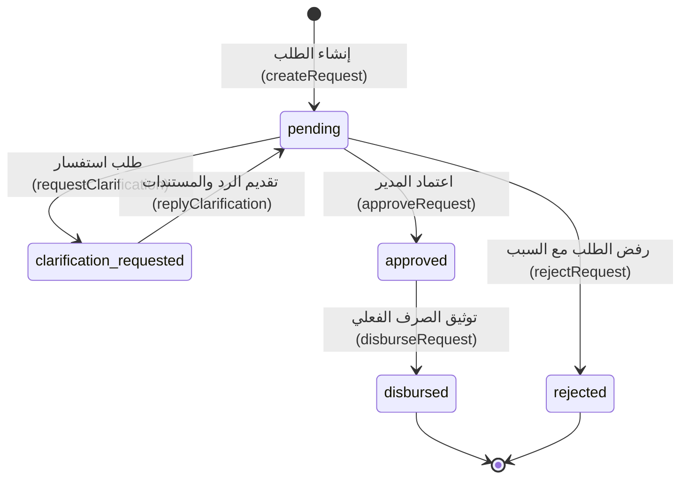
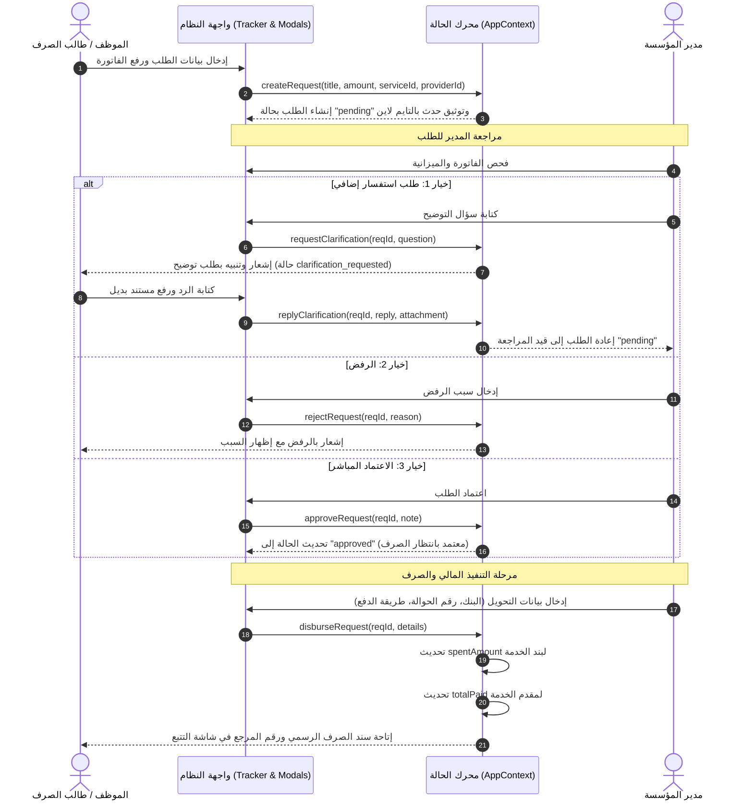

# 03 - Workflows & Lifecycle (دورة العمل وحالات الطلبات)

> **تصنيف الأدلة البرمجية:**
> - [VERIFIED]: مستخرج مباشرة من دوال التحكّم في `src/context/AppContext.tsx` (`createRequest`, `approveRequest`, `rejectRequest`, `requestClarification`, `replyClarification`, `disburseRequest`).

---

## 1. آلة الحالة المحددة (State Machine Diagram)

---

## 2. مخطط التسلسل التفاعلي لدورة الصرف (Sequence Diagram)

---

## 3. العمليات المحاسبية المصاحبة للصرف (Financial Invariants)

عند استدعاء `disburseRequest(requestId, details)`، يتم تنفيذ العمليات الذرية التالية:
1. **تحديث حالة الطلب:** من `approved` إلى `disbursed`.
2. **إنشاء كائن سند الصرف (`disbursement`):** يتضمن `paymentMethod`، `referenceNumber`، `bankName`، `disbursedAt`، و `disbursedBy`.
3. **تحديث استهلاك ميزانية الخدمة:**
   $$\text{spentAmount}_{\text{new}} = \text{spentAmount}_{\text{prev}} + \text{amount}$$
4. **تحديث سجل مدفوعات المورد:**
   $$\text{totalPaid}_{\text{new}} = \text{totalPaid}_{\text{prev}} + \text{amount}$$
5. **إضافة حدث مكتمل في السجل الزمني (`TimelineEvent`):** لتوثيق رقم الحوالة واسم القائم بالعملية للتدقيق المحاسبي اللاحق.
