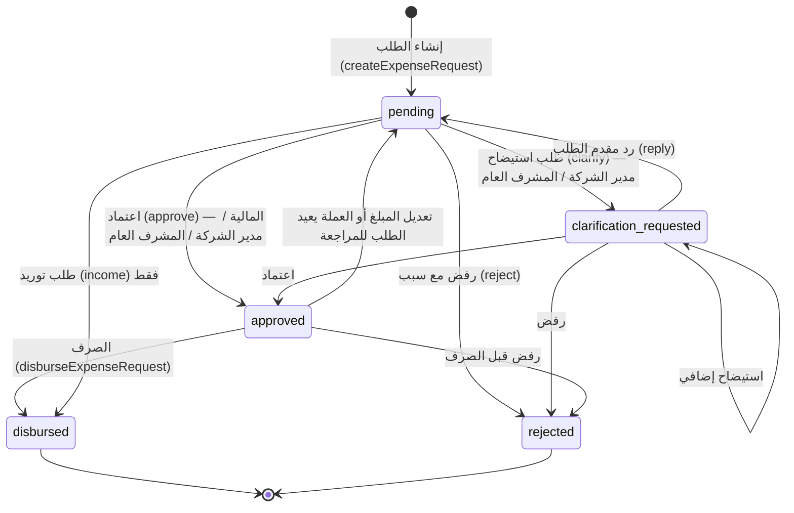
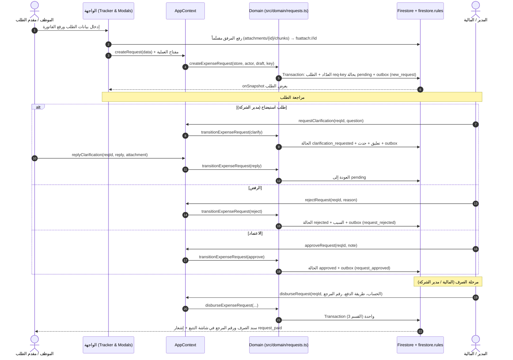

# 03 - Workflows & Lifecycle (دورة العمل وحالات الطلبات)

> **تصنيف الأدلة البرمجية:**
> - [VERIFIED]: مستخرج من `src/domain/requests.ts` (`createExpenseRequest`, `updateExpenseRequest`, `transitionExpenseRequest` وجدول `TRANSITIONS`, `disburseExpenseRequest`)،
>   ومن دوال السياق التي تستدعيها في `src/context/AppContext.tsx`، ومن قسم `match /requests` في `firestore.rules`.

---

## 1. آلة الحالة المحددة (State Machine Diagram)

```mermaid
stateDiagram-v2
    [*] --> pending: إنشاء الطلب (createExpenseRequest)

    pending --> clarification_requested: طلب استيضاح (clarify) — مدير الشركة / المشرف العام
    clarification_requested --> clarification_requested: استيضاح إضافي
    clarification_requested --> pending: رد مقدم الطلب (reply)

    pending --> approved: اعتماد (approve) — المالية / مدير الشركة / المشرف العام
    clarification_requested --> approved: اعتماد
    approved --> pending: تعديل المبلغ أو العملة يعيد الطلب للمراجعة

    pending --> rejected: رفض مع سبب (reject)
    clarification_requested --> rejected: رفض
    approved --> rejected: رفض قبل الصرف

    approved --> disbursed: الصرف (disburseExpenseRequest)
    pending --> disbursed: طلب توريد (income) فقط
    disbursed --> [*]
    rejected --> [*]
```

- `disbursed` حالة نهائية: الطلب المصروف لا يُصرف مرة أخرى أبداً (`already_disbursed`)، ولا يُرفض.
- تكرار نفس الانتقال (نقرة مزدوجة، إعادة محاولة، مستخدم ثانٍ) لا يُنشئ حدثاً ثانياً في السجل الزمني ولا إشعاراً ثانياً: معرّف الحدث `tl-<مفتاح العملية>`، والانتقال إلى الحالة الحالية نفسها لا يفعل شيئاً (`already_in_state`).
- القواعد (`firestore.rules` → `requests`) تفرض نفس الانتقالات والأدوار: السجل الزمني والتعليقات تُضاف فقط، والاعتماد لا يغيّر المستفيد ولا يسمّي معتمداً آخر، والحالة `disbursed` لا تُكتب إلا مع قيد الدفتر الخاص بالطلب في نفس الـ commit.

---

## 2. مخطط التسلسل التفاعلي لدورة الصرف (Sequence Diagram)

```mermaid
sequenceDiagram
    autonumber
    actor Emp as الموظف / مقدم الطلب
    participant UI as الواجهة (Tracker & Modals)
    participant Ctx as AppContext
    participant Dom as Domain (src/domain/requests.ts)
    participant FS as Firestore + firestore.rules
    actor Mgr as المدير / المالية

    Emp->>UI: إدخال بيانات الطلب ورفع الفاتورة
    UI->>FS: رفع المرفق مقسَّماً (attachments/{id}/chunks) → fsattach://id
    UI->>Ctx: createRequest(data) + مفتاح العملية
    Ctx->>Dom: createExpenseRequest(store, actor, draft, key)
    Dom->>FS: Transaction: العدّاد + الطلب req-key بحالة pending + outbox (new_request)
    FS-->>UI: onSnapshot يعرض الطلب

    Note over Mgr,UI: مراجعة الطلب

    alt طلب استيضاح (مدير الشركة)
        Mgr->>Ctx: requestClarification(reqId, question)
        Ctx->>Dom: transitionExpenseRequest(clarify)
        Dom->>FS: الحالة clarification_requested + تعليق + حدث + outbox
        Emp->>Ctx: replyClarification(reqId, reply, attachment)
        Ctx->>Dom: transitionExpenseRequest(reply)
        Dom->>FS: العودة إلى pending
    else الرفض
        Mgr->>Ctx: rejectRequest(reqId, reason)
        Ctx->>Dom: transitionExpenseRequest(reject)
        Dom->>FS: الحالة rejected + السبب + outbox (request_rejected)
    else الاعتماد
        Mgr->>Ctx: approveRequest(reqId, note)
        Ctx->>Dom: transitionExpenseRequest(approve)
        Dom->>FS: الحالة approved + outbox (request_approved)
    end

    Note over Mgr,FS: مرحلة الصرف (المالية / مدير الشركة)
    Mgr->>Ctx: disburseRequest(reqId, الحساب، طريقة الدفع، رقم المرجع)
    Ctx->>Dom: disburseExpenseRequest(...)
    Dom->>FS: Transaction واحدة (القسم 3)
    FS-->>Emp: سند الصرف ورقم المرجع في شاشة التتبع + إشعار request_paid
```

---

## 3. العمليات المحاسبية المصاحبة للصرف (Financial Invariants)

`disburseExpenseRequest` تنفّذ كل ما يلي في **Transaction واحدة** (كلها أو لا شيء):
1. **التحقق:** الطلب `approved` (أو `pending` لطلب التوريد `income`)، والحساب من نفس الشركة، نشط، وبنفس العملة.
2. **تحديث حالة الطلب:** إلى `disbursed` مع كائن `disbursement` (`paymentMethod`, `referenceNumber`, `accountId`, `accountName`, `disbursedAt`, `disbursedBy`) وحدث في السجل الزمني.
3. **حركة الحساب وقيد الدفتر:** قيد بمعرّف حتمي `tx-req-<requestId>` (`out` للصرف، `in` للتوريد)، والرصيد يُحسب من القيمة المقروءة داخل الـ Transaction:
   $$\text{currentBalance}_{\text{new}} = \text{currentBalance}_{\text{prev}} \mp \text{amount}$$
   بدون سحب على المكشوف (`insufficient_funds`)، والإنستاباي ينعكس على البنك المرتبط به. الحساب يحمل `lastLedgerId` = القيد.
4. **تحديث استهلاك ميزانية البند** (للصرف فقط، وإن كان البند يخص شركة الطلب أو مشاركاً معها):
   $$\text{spentAmount}_{\text{new}} = \text{spentAmount}_{\text{prev}} + \text{amount}$$
   مع `lastDisbursedRequestId = requestId`.
5. **تحديث سجل مدفوعات المورد** (للصرف فقط):
   $$\text{totalPaid}_{\text{new}} = \text{totalPaid}_{\text{prev}} + \text{amount}$$
   مع `lastDisbursedRequestId = requestId`.
6. **سجل التدقيق** (`audit-<key>-disburse`) و**حدث الإشعار** `request_paid__<requestId>` في `outbox`.

القواعد تتحقق في نفس الـ commit أن كل زيادة في `spentAmount` / `totalPaid` تساوي مبلغ الطلب الذي صُرف فيه، وأن كل تغيير في رصيد الحساب له قيد جديد بنفس المبلغ
(`tests-rules/binding.test.ts`: `[AGG-B1 DIR-3]`, `[TRE-6]`, `[REQ-3 TRE-7]`).
